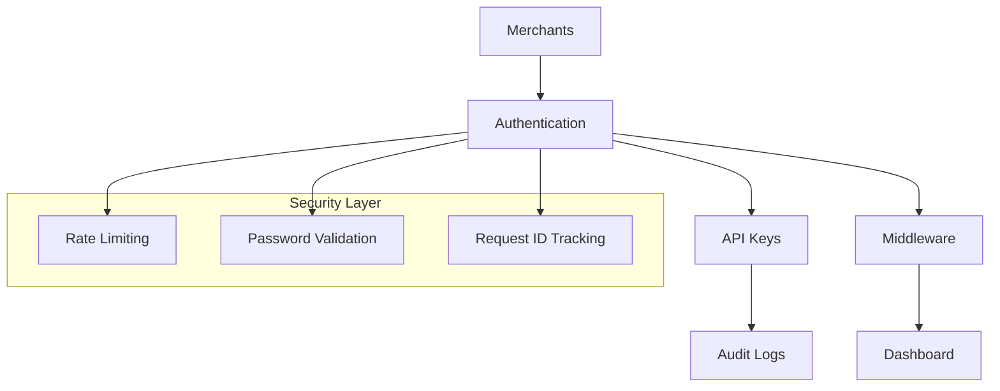

# Stripe Clone Foundation

⚠️ **WARNING: Educational Demo Only - Not Suitable for Real Transactions**

A production-grade foundational database schema and merchant authentication system for an educational Stripe replica, designed for scale, security, and developer experience.

## 🎯 What This Is

This is a **foundational authentication and database layer** that provides:
- Multi-tenant merchant management
- Secure API key system with rotation
- Comprehensive audit logging
- Rate limiting and security features
- NextAuth.js v5 authentication
- Production-ready patterns and architecture

**Phase 1** (Complete): Foundation - Authentication, API keys, and database schema
**Phase 2** (Complete): Payment Processing - Card tokenization, fraud detection, and charge processing

## 🏗️ Architecture



## ✨ Features

### 🔐 Authentication & Security
- **NextAuth.js v5** with credentials provider
- **bcryptjs** password hashing (12 rounds)
- **JWT tokens** with custom claims for tenant isolation
- **Rate limiting** with exponential backoff
- **Password strength validation** (14+ chars, uppercase, numbers, special chars)
- **Account lockout** after 5 failed attempts
- **Request ID tracking** for debugging and support

### 🗄️ Database Schema
- **Multi-tenant architecture** with merchant isolation
- **Soft delete pattern** for audit compliance
- **Comprehensive indexing** for performance
- **Audit logging** for all security events
- **API key management** with rotation history
- **Webhook endpoints** with failure tracking
- **Merchant settings** and preferences

### 🔑 API Key System
- **Stripe-like format**: `pk_live_xxx` and `sk_live_xxx`
- **Secure secret key hashing** with bcrypt
- **Key rotation** with history tracking
- **IP whitelisting** and endpoint restrictions
- **Usage tracking** with last-used timestamps
- **CLI management tool** for operations

### 🛡️ Security Features
- **CSP headers** and security middleware
- **CSRF protection** with NextAuth
- **SQL injection prevention** with Prisma
- **XSS protection** headers
- **Structured logging** for monitoring
- **Audit trail** for compliance (7-year retention ready)

### 💳 Payment Processing (Phase 2)
- **Card tokenization** - Simulated secure card storage (never stores raw PAN)
- **Luhn validation** - Card number checksum validation
- **Fraud detection engine** - Multi-rule risk scoring system
- **Authorization simulation** - Bank authorization with test cards
- **3D Secure support** - SCA compliance for high-risk transactions
- **Refund processing** - Full and partial refund capabilities
- **Webhook system** - HMAC-signed event delivery
- **PaymentIntent flow** - Modern payment confirmation pattern

## 🚀 Quick Start

```bash
# Clone and install
git clone <repository>
cd stripe-clone-foundation
npm install

# Start database (using Docker)
docker run --name stripe-db -e POSTGRES_PASSWORD=password -e POSTGRES_DB=stripe_clone_dev -p 5432:5432 -d postgres:15

# Configure environment
cp .env.example .env
openssl rand -base64 32  # Generate secret

# Setup database
npm run db:migrate
npm run db:seed

# Start development
npm run dev
```

Visit http://localhost:3000 and use test accounts:
- **demo@stripe-clone.test** / Demo1234! (Starter)
- **pro@stripe-clone.test** / ProDemo1234! (Pro)  
- **enterprise@stripe-clone.test** / EntDemo1234! (Enterprise)

## 📚 Documentation

| Document | Description |
|----------|-------------|
| [SETUP.md](./SETUP.md) | Complete setup and installation guide |
| [API.md](./API.md) | Payment API endpoints and reference |
| [FRAUD_RULES.md](./FRAUD_RULES.md) | Fraud detection rules and scoring |
| [FAKE_CARDS.md](./FAKE_CARDS.md) | Test card numbers for development |
| [SECURITY.md](./SECURITY.md) | Security considerations and production checklist |

## 🧪 Testing

```bash
# Run all tests
npm run test

# Run tests in watch mode
npm run test:watch

# Run with coverage
npm run test -- --coverage
```

Test coverage includes:
- Authentication flows
- Password validation
- API key generation and validation
- Rate limiting logic
- Database operations
- Security middleware
- Card tokenization and validation
- Fraud detection rules
- Payment authorization
- Refund processing

## 🔧 API Key Management

### CLI Tool

```bash
# Generate new API key
npm run manage-api-keys generate --merchant-email=demo@stripe-clone.test --name="Production"

# List all API keys
npm run manage-api-keys list-all

# Revoke API key
npm run manage-api-keys revoke --key-id=<key-id>

# Rotate secret key
npm run manage-api-keys rotate --key-id=<key-id> --reason=scheduled
```

### API Endpoints (Coming in Phase 2)

```typescript
// Authentication
POST /api/auth/signin
POST /api/auth/signup  
POST /api/auth/signout

// API Keys (Phase 2)
POST /api/api-keys
GET /api/api-keys
PUT /api/api-keys/:id/rotate
DELETE /api/api-keys/:id

// Webhooks (Phase 2)
POST /api/webhooks
GET /api/webhooks
```

## 🏗️ Tech Stack

- **Runtime**: Node.js 18+
- **Framework**: Next.js 14 (App Router)
- **Database**: PostgreSQL 14+
- **ORM**: Prisma 5
- **Authentication**: NextAuth.js v5
- **Validation**: Zod
- **Testing**: Jest + React Testing Library
- **TypeScript**: Strict mode
- **Security**: bcryptjs, JWT, CSP headers

## 📊 Database Schema

### Core Tables
- `merchants` - Multi-tenant merchant accounts
- `api_keys` - API key management with rotation
- `api_key_rotations` - Key rotation history
- `webhook_endpoints` - Event subscription endpoints
- `merchant_settings` - Per-merchant configuration
- `audit_logs` - Security and compliance events

### Phase 2+ Tables (Placeholders)
- `products`, `prices` - Product catalog
- `customers` - Customer management
- `payment_intents`, `charges` - Payment processing
- `subscriptions` - Recurring billing

## 🔐 Security Features

### Authentication Security
- Password hashing with bcrypt (12 rounds)
- JWT tokens with 30-day expiry
- Session management with secure cookies
- Rate limiting (5 attempts, 15-minute window)
- Account lockout with exponential backoff

### API Security  
- Secret key hashing and validation
- IP whitelisting support
- Endpoint restriction capabilities
- Key rotation with audit trail
- Usage tracking and monitoring

### Infrastructure Security
- CSP headers to prevent XSS
- CSRF protection
- SQL injection prevention (Prisma)
- Request ID tracking for debugging
- Structured logging for monitoring

## 🚦 Development Workflow

```bash
# Start development
npm run dev

# Database operations
npm run db:migrate    # Create migrations
npm run db:seed       # Seed test data
npm run db:studio     # Open database GUI

# Code quality
npm run lint          # ESLint
npm run type-check    # TypeScript

# Production build
npm run build
npm run start
```

## 🌐 Environment Variables

```env
# Database
DATABASE_URL="postgresql://..."

# NextAuth
NEXTAUTH_URL="http://localhost:3000"
NEXTAUTH_SECRET="generated-secret"

# Security
RATE_LIMIT_ATTEMPTS="5"
RATE_LIMIT_WINDOW_MS="900000"
JWT_EXPIRY_DAYS="30"
```

See [.env.example](./.env.example) for complete configuration options.

## 🎯 Phase 2 Roadmap

This foundation enables Phase 2 development:

- [ ] Payment Intent creation and client secrets
- [ ] Card tokenization (simulated)  
- [ ] Fraud rules engine (velocity, BIN checks)
- [ ] Authorization response handling
- [ ] Charge model and creation
- [ ] Webhook event delivery system
- [ ] Multi-currency support
- [ ] Refund and dispute handling

## ⚠️ Security Warnings

**🔴 CRITICAL: This is an educational demo. Real Stripe uses:**
- OAuth 2.0 / OIDC for enterprise SSO
- Multi-factor authentication (TOTP, WebAuthn)  
- Hardware security modules (HSM) for key signing
- Regular security audits & penetration testing
- PCI DSS Level 1 certification
- Bank partnerships and compliance frameworks

**This demo is NOT suitable for real transactions or production use.**

## 🤝 Contributing

1. Fork the repository
2. Create a feature branch
3. Make your changes
4. Add tests for new functionality  
5. Run `npm run test` and `npm run lint`
6. Submit a pull request

See [CONTRIBUTING.md](./CONTRIBUTING.md) for detailed guidelines.

## 📄 License

This project is for educational purposes only. See LICENSE file for details.

## 🆘 Support

For questions or issues:
1. Check the documentation in `/docs`
2. Search existing issues
3. Create a new issue with detailed description
4. Include environment details and error logs

---

**Built with ❤️ for learning purposes. Not for production use.**
